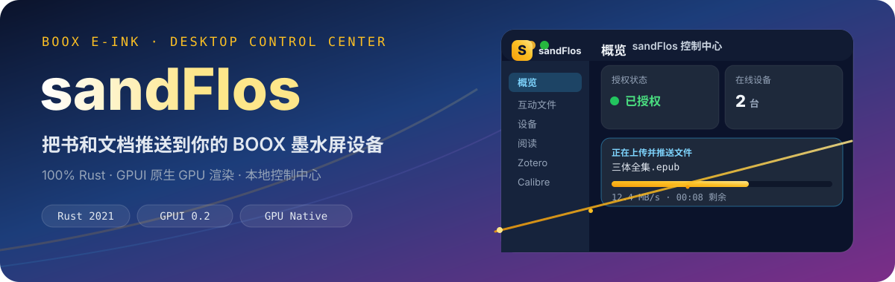

<p align="center">
  
</p>

# sandFlos

**sandFlos** 是 100% Rust 编写、GPUI 原生 GPU 渲染的桌面控制中心。它把「上传 → 推送」到 BOOX 墨水屏设备的流程，收敛成一个本地原生应用：登录授权、云空间、设备、阅读指标、互动文件队列、Zotero 与 Calibre 双书库，全部在 Rust 进程中完成，不依赖任何 WebView。

## 为什么是 sandFlos

| | 传统 WebView 方案 | sandFlos |
| --- | --- | --- |
| 渲染 | WebView / WebKit 进程 | GPUI 原生 GPU 渲染 |
| 前端 | HTML / CSS / JS | Rust 直接驱动 UI |
| 通信 | JSON IPC 序列化 | 同进程直接调用 |
| 内存占用 | 通常 100MB+ | 约 20–40MB |
| 冷启动 | 数百毫秒 | 瞬时 |

- **无 WebView、无 PouchDB、无隐藏页面注入**：彻底移除旧架构的浏览器桥接层。
- **登录授权**：默认浏览器打开本地回环登录页，二维码授权后 token 直接回流桌面端。
- **Rust 直传 OSS**：STS 签名 + 分片进度上报，实时显示速度、剩余时间（ETA）与结果。

## 核心能力

- **概览仪表盘**：授权状态、在线设备、今日阅读、互动文件队列，一张快照看全。
- **互动文件队列**：原生「重推」「删除」，实时上传进度条 + 速度 + ETA。
- **设备与互传**：局域网设备识别，安全的互传地址打开（仅允许合法局域网地址）。
- **阅读指标**：今日阅读、本周时长、累计完成，直接聚合云端数据。
- **Zotero 工作流**：直接读本地 `zotero.sqlite`，附件缺失时走 WebDAV 拉取后推送。
- **Calibre 工作流**：读取 `metadata.db`，按书籍格式（EPUB / PDF / AZW3 / MOBI）一键推送。
- **系统托盘**：登录、上传、刷新、开机自启动开关、退出，左键显示/隐藏。

<p align="center">
  
</p>

## 架构

```
sandFlos
├── crates/core/          # 纯 Rust 领域逻辑（与 UI 框架解耦）
│   ├── api.rs            # Send2Boox API / OSS / STS / neocloud
│   ├── auth.rs           # 本地回环登录与二维码授权回流
│   ├── push.rs           # OSS 直传状态机与推送队列
│   ├── device.rs         # 局域网设备发现与互传校验
│   ├── zotero.rs         # Zotero SQLite + WebDAV 同步
│   ├── calibre.rs        # Calibre metadata.db 读取与直传
│   └── dashboard.rs      # 仪表盘快照聚合
└── crates/app/           # GPUI 原生前端
    ├── components/       # 侧栏、工具栏等 UI 组件
    └── views/            # 概览 / 互动文件 / 设备 / 阅读 / Zotero / Calibre
```

## 快速开始

### 运行（开发）

```bash
cd /Volumes/DataCenter_01/boox-tauri
cargo build --release -p send2boox-desktop-gpui
./target/release/send2boox-desktop-gpui
```

### 打包 macOS .app

```bash
cargo build --release -p send2boox-desktop-gpui
# 将 target/release/send2boox-desktop-gpui 放入 .app/Contents/MacOS/，
# 并配置 Info.plist 与 Resources 图标后，用 open 打开即可
```

> 项目也保留旧版 `src-tauri`（Tauri）构建目录，但**当前产品形态是 GPUI 原生版**，即 `crates/app`。

## 登录与授权

1. 点击「登录并授权」，桌面端启动本地回环端口并打开默认浏览器。
2. 在浏览器中完成官方二维码登录。
3. token 自动回流桌面端，回到本地仪表盘——无需抓取网页标题、hash 或 cookie。

## 测试

```bash
cd /Volumes/DataCenter_01/boox-tauri
cargo test --workspace
```

## 项目结构约定

- 新增业务逻辑优先放入 `crates/core`，与 UI 无关、可独立测试。
- UI 组件与视图放入 `crates/app`，通过 `Entity<AppState>` 响应式状态驱动。
- 本地数据（登录态、Zotero / Calibre 配置）默认位于
  `~/Library/Application Support/com.fallingstar.send2boox/`。

## License

UNLICENSED · © Fallingstar Team
